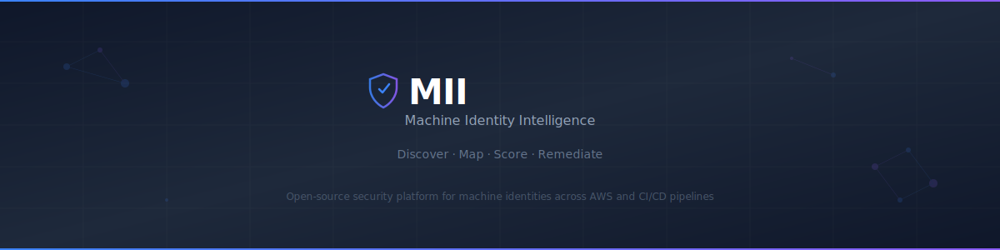
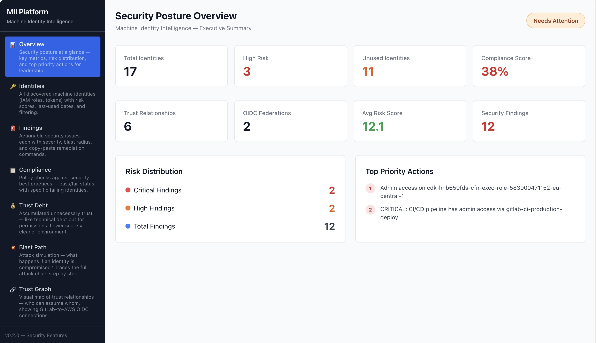
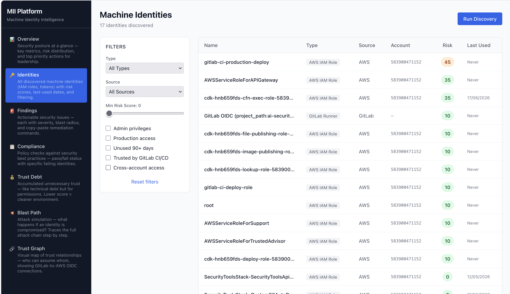
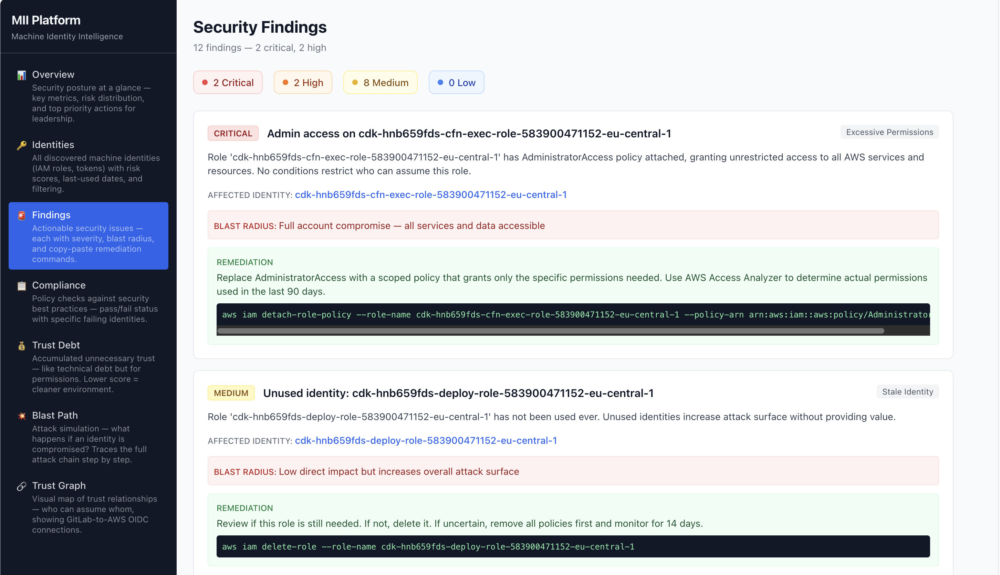
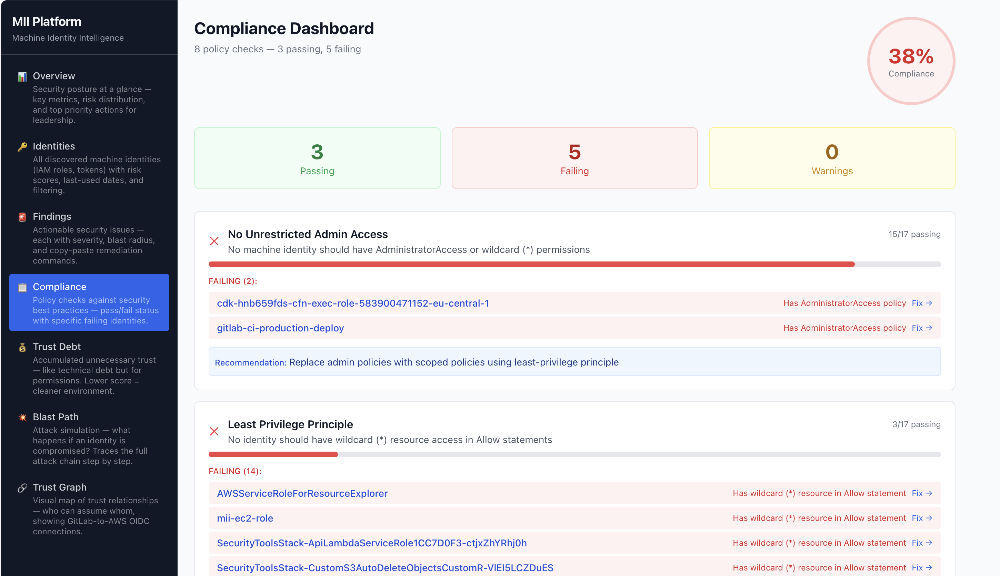
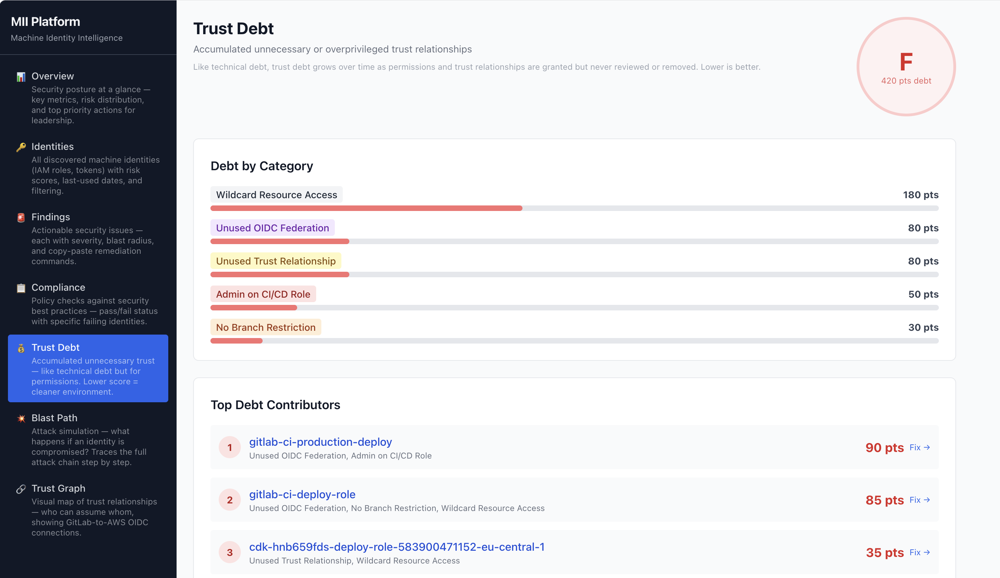
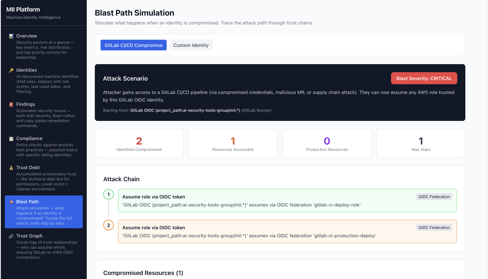
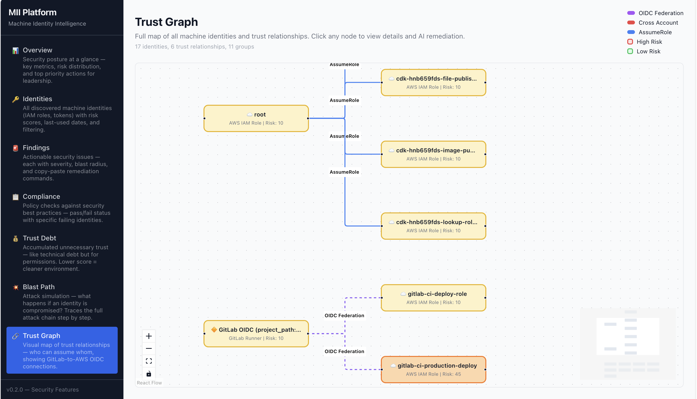
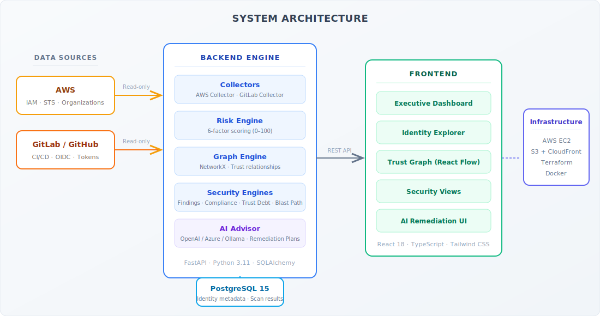

<p align="center">

</p>

<p align="center">


</p>

<p align="center">
<a href="#quick-start">Quick Start</a> · <a href="./SETUP.md">Full Setup Guide</a> · <a href="./docs/README.md">Documentation</a> · <a href="./docs/features.md">Features</a> · <a href="./docs/api-reference.md">API Reference</a>
</p>

---

<br/>

<p align="center">

</p>

<br/>

---

Machine identities (IAM roles, service accounts, CI/CD tokens, OIDC federations) outnumber human identities by [45:1 to 82:1](https://investors.cyberark.com/news/news-details/2025/Machine-Identities-Outnumber-Humans-by-More-Than-80-to-1-New-Report-Exposes-the-Exponential-Threats-of-Fragmented-Identity-Security/) in modern cloud environments. They are the #1 attack vector for cloud breaches — yet most organizations have zero visibility into them.

**MII changes that.**

---

## What It Does

| | Capability | Description |
|---|-----------|-------------|
| 🔍 | **Discovery** | Auto-discovers every IAM role, OIDC federation, and CI/CD identity across AWS and GitLab/GitHub |
| 🕸️ | **Trust Mapping** | Builds a directed graph of all trust relationships, revealing hidden lateral movement paths |
| 📊 | **Risk Scoring** | Scores every identity 0–100 using six weighted factors (admin, production, trust, cross-account, staleness, unused) |
| 💥 | **Blast Path Simulation** | "What if compromised?" — traces the full attack chain through the trust graph |
| 📈 | **Trust Debt** | Quantifies accumulated unnecessary trust, graded A–F, with specific reduction actions |
| ✅ | **Compliance** | 8 automated policy checks with pass/fail evidence and compliance score |
| 🤖 | **AI Remediation** | OpenAI-powered fix plans with exact AWS CLI commands and Terraform code |
| 📥 | **Report Export** | Download any tab as PDF, Markdown, or Excel — ready for audits and stakeholder reporting |

---

## Platform Screenshots

<details>
<summary><b>Expand to view all features</b></summary>

<br/>

| | |
|:---:|:---:|
|  |  |
| **Identity Discovery** | **Trust Graph** |
| Complete inventory with risk scores | Interactive trust relationship visualization |
|  |  |
| **Security Findings** | **Compliance Dashboard** |
| Prioritized findings with remediation | 8 policy checks with pass/fail evidence |
|  |  |
| **Trust Debt Score** | **Blast Path Simulation** |
| Unnecessary trust graded A–F | Full attack chain visualization |

</details>

---

## Why This Matters

```
Thousands of machine identities → No centralized visibility
Overprivileged CI/CD pipelines → One merge request = full AWS admin
Invisible trust relationships → Unknown lateral movement paths
Unused identities accumulate → Dormant backdoors in every account
```

**Real-world scenarios MII catches:**
- OIDC federation from GitLab → AWS with no branch restriction (any MR author becomes AWS admin)
- IAM roles with active trust policies unused for 90+ days (dormant backdoors)
- Cross-account trust without ExternalId (confused deputy attacks)
- CI/CD pipelines with admin permissions on production accounts

---

## Quick Start

```bash
git clone https://github.com/YOUR_ORG/mii.git
cd mii
cp .env.example .env
# Edit .env with your AWS account ID and region
docker-compose up --build
docker-compose exec backend alembic upgrade head
```

```
Frontend  → http://localhost:3000
API Docs  → http://localhost:8000/docs
```

> For production deployment (AWS EC2 + S3 + CloudFront), see the [Full Setup Guide](./SETUP.md).

---

## AI-Powered Features

> Optional — the platform works fully without AI. Add an OpenAI key to unlock these capabilities.

| Feature | What It Does |
|---------|-------------|
| **Explain Risk** | "Why is this identity risky?" — plain English explanation |
| **Remediation Plan** | Step-by-step fix with AWS CLI commands + Terraform code |

```bash
# Setup (2 minutes)
export OPENAI_API_KEY=sk-your-key  # ~$0.001 per call
```

---

## Architecture

<p align="center">

</p>

| Layer | Technology |
|-------|-----------|
| Frontend | React 18, TypeScript, React Flow, TanStack Query, Tailwind CSS |
| Backend | FastAPI, Python 3.11, SQLAlchemy 2.0, Pydantic |
| Database | PostgreSQL 15 |
| Graph Engine | NetworkX (in-memory directed graph) |
| AI | OpenAI GPT-4o-mini |
| Infrastructure | AWS (EC2, S3, CloudFront), Terraform |
| CI/CD | GitHub Actions (GitLab CI/CD also supported) |

---

## Security Principles

| Principle | Detail |
|-----------|--------|
| Read-only | Only read permissions for AWS and GitLab/GitHub — no mutations |
| No source code | Never reads, stores, or processes application source code |
| No secrets | Stores only identity metadata — never credential values |
| No customer data | Only identity relationships and access metadata |
| AI guardrails | AI receives only metadata — never credentials or PII |

---

## Documentation

| | |
|---|---|
| [Full Setup Guide](./SETUP.md) | [Architecture](./docs/architecture.md) |
| [Getting Started](./docs/getting-started.md) | [Features Guide](./docs/features.md) |
| [API Reference](./docs/api-reference.md) | [Risk Scoring](./docs/risk-scoring.md) |
| [Trust Debt](./docs/trust-debt.md) | [Blast Path](./docs/blast-path.md) |
| [Deployment](./docs/deployment.md) | [Configuration](./docs/configuration.md) |
| [Contributing](./docs/contributing.md) | [GitLab Setup](./SETUP.md#gitlab-cicd-alternative) |

---

## How MII Compares

| | Existing Tools | MII |
|---|---------------|-----|
| Focus | Human identities | **Machine identities only** |
| Visibility | List permissions | **Map trust chains end-to-end** |
| Risk | Static scores | **Blast path simulation** |
| Debt | No tracking | **Trust debt score (A–F)** |
| Remediation | Manual | **AI-generated CLI + Terraform** |
| Scope | Single platform | **Unified AWS + GitLab/GitHub** |

---

<details>
<summary><b>Who Benefits</b></summary>
<br/>

**Security Engineers** — Discover identities, get prioritized findings with copy-paste commands, simulate attack paths, track trust debt reduction.

**Security Managers** — Executive dashboard, quantified risk metrics for board reporting, compliance scores, improvement trends.

**Platform/DevOps** — Identify overprivileged CI/CD roles, get Terraform fix snippets, find OIDC federations needing branch restrictions.

**Compliance & Audit** — 8 automated policy checks, exportable scores, identity ownership tracking, stale identity identification.

</details>

---

<p align="center">
<sub>MIT License</sub>
</p>
